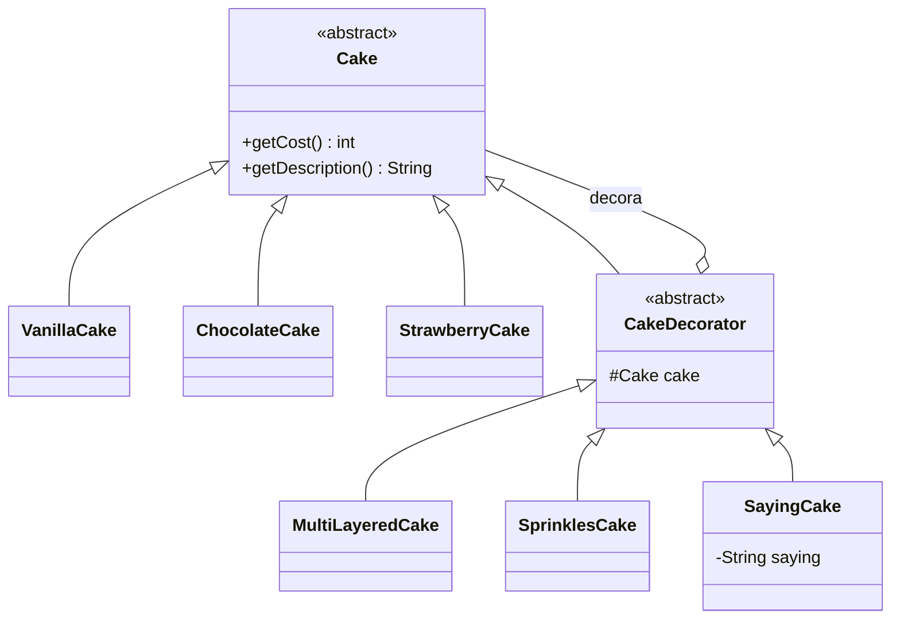

# Diagrama simplificado

```mermaid
classDiagram
    class Cake {
        <<abstract>>
        +getCost() int
        +getDescription() String
    }

    class VanillaCake
    class ChocolateCake
    class StrawberryCake

    class CakeDecorator {
        <<abstract>>
        #Cake cake
    }

    class MultiLayeredCake
    class SprinklesCake
    class SayingCake {
        -String saying
    }

    Cake <|-- VanillaCake
    Cake <|-- ChocolateCake
    Cake <|-- StrawberryCake
    Cake <|-- CakeDecorator
    CakeDecorator <|-- MultiLayeredCake
    CakeDecorator <|-- SprinklesCake
    CakeDecorator <|-- SayingCake
    CakeDecorator o-- Cake : decora
```
