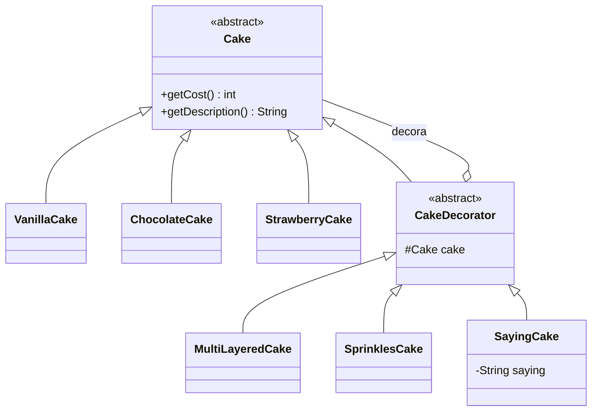

# Padrão Decorator - Prática de Padaria

Este projeto documenta a evolução de uma implementação do padrão de projeto Decorator aplicada a uma loja de bolos. A ideia principal é permitir adicionar características extras a um bolo sem alterar as classes concretas existentes, usando composição em vez de herança.

## Objetivo

O objetivo da prática é demonstrar como:

- um componente base pode ser representado por uma abstração (`Cake`);
- diferentes sabores podem ser criados como componentes concretos;
- decoradores podem acrescentar comportamento adicional;
- vários decoradores podem ser combinados em uma mesma ordem;
- novas variações podem ser adicionadas sem quebrar o restante do sistema.

---

## Estrutura do projeto

A organização do código segue o padrão Decorator:

- `Cake`: componente base abstrato;
- `ChocolateCake`, `VanillaCake`, `StrawberryCake`: componentes concretos;
- `CakeDecorator`: classe abstrata para encapsular outro `Cake`;
- `MultiLayeredCake`, `SprinklesCake`, `SayingCake`: decoradores específicos;
- `Order`: responsável por armazenar e imprimir o pedido;
- `Main`: simulação final do uso do padrão.

### Diagrama conceitual

---

## Etapa 1 — Identificar a estrutura necessária

### Prompt

> Analise o código inicial da prática de Padaria e explique, passo a passo, como aplicar o padrão Decorator sem resolver toda a questão de uma vez. Na primeira etapa, crie somente a abstração necessária para que decoradores possam envolver objetos `Cake` e delegar custo e descrição. Preserve as classes existentes sempre que possível.

### O que foi feito

Foi criada a abstração `CakeDecorator`, que:

- guarda uma referência ao bolo decorado;
- implementa a mesma interface/abstração de `Cake`;
- delega `getCost()` e `getDescription()` ao objeto encapsulado;
- permite que cada decorador altere apenas um comportamento específico.

### Benefício

Essa etapa estabelece a base do padrão, sem alterar as classes concretas já existentes. A estrutura deixa pronta a composição de decoradores em camadas.

---

## Etapa 2 — Decorador de multicamadas

### Prompt

> Continue a implementação do padrão Decorator. Agora crie apenas o decorador de bolo multicamadas. Ele deve acrescentar 5 ao custo e colocar `Multi-layered` antes da descrição do bolo recebido. Não altere as classes concretas já existentes.

### O que foi feito

Foi criado o decorador `MultiLayeredCake`, que:

- adiciona +5 ao custo do bolo base;
- insere a descrição `Multi-layered` antes da descrição original;
- mantém a lógica de delegação para o objeto interno.

### Benefício

O decorador centraliza a funcionalidade extra sem mexer na classe do bolo original, demonstrando a flexibilidade do padrão.

---

## Etapa 3 — Decorador de granulado

### Prompt

> Continue a solução. Crie apenas o decorador de granulado. Ele deve acrescentar 2 ao custo e adicionar `with sprinkles` ao final da descrição, mantendo a possibilidade de combinar vários decoradores.

### O que foi feito

Foi criado o decorador `SprinklesCake`, que:

- aumenta o custo em 2 unidades;
- acrescenta a expressão `with sprinkles` ao final da descrição;
- pode ser empilhado com outros decoradores, como multilayer ou mensagem.

### Benefício

Isso mostra que um mesmo bolo pode ganhar múltiplos adornos em sequência, e que cada decorador é independente do restante da cadeia.

---

## Etapa 4 — Decorador de mensagem

### Prompt

> Continue a solução. Crie apenas o decorador de mensagem, que recebe um texto no construtor, não altera o custo e acrescenta `with saying "X"` ao final da descrição do bolo decorado.

### O que foi feito

Foi criado o decorador `SayingCake`, que:

- recebe uma mensagem textual no construtor;
- não altera o valor do bolo;
- acrescenta no final da descrição a frase `with saying "X"`.

### Benefício

Esse decorador demonstra que é possível adicionar comportamento de forma totalmente opcional e sem interferir no custo do produto base.

---

## Etapa 5 — Novo tipo de bolo

### Prompt

> Agora acrescente o novo tipo de bolo de morango. Ele deve ser um novo componente concreto, sem exigir alterações nas classes de bolo existentes ou nos decoradores. O custo deve ser o dobro do bolo padrão e a descrição deve ser `Strawberry cake`.

### O que foi feito

Foi criado o componente concreto `StrawberryCake`, que:

- estende `Cake` diretamente;
- possui custo equivalente ao dobro do bolo padrão;
- retorna a descrição `Strawberry cake`.

### Benefício

A criação de um novo sabor sem mexer em outros componentes prova que o padrão facilita a extensão do sistema sem impactar o restante da estrutura.

---

## Etapa 6 — Simulação final do pedido

### Prompt

> Por fim, altere somente `Main.java` para montar o pedido solicitado no exercício: chocolate; baunilha com `PLAIN!`; baunilha com granulado e `FANCY!`; e morango multicamadas com granulado duplo e as mensagens `One of` e `EVERYTHING`. Use composição de decoradores e imprima a `Order`.

### O que foi feito

A simulação final foi montada em `Main.java`, criando um pedido com os itens pedidos pelo exercício:

1. bolo de chocolate;
2. baunilha com `PLAIN!`;
3. baunilha com granulado e `FANCY!`;
4. morango multicamadas com granulado duplo e as mensagens `One of` e `EVERYTHING`.

A ordem foi impressa por `Order.printOrder()`, mostrando descrição e custo de cada item.

### Observação

A documentação do enunciado menciona `FANCY`, mas o exemplo de saída adotado foi `FANCY!` para reproduzir a saída apresentada no exercício. Essa decisão foi aplicada para manter a representação visual esperada.

---

## Ajustes e decisões de projeto

- A abstração `CakeDecorator` evita duplicar a referência ao bolo decorado em cada classe de decoração;
- cada decorador altera apenas o comportamento de sua responsabilidade;
- a lógica de custo e descrição é preservada por delegação ao objeto interno;
- `StrawberryCake` foi adicionado como novo `Cake`, sem mexer nos sabores existentes;
- a composição de decoradores permite empilhar vários adereços em um único bolo;
- `SprinklesCake` aplicado duas vezes representa dois granulados e aumenta o preço em 4 unidades.

---

## Resultado final

A prática mostra que o padrão Decorator é especialmente útil quando:

- o número de combinações cresce;
- queremos adicionar comportamento incrementalmente;
- queremos manter o código aberto para extensão e fechado para modificação;
- queremos evitar heranças múltiplas e classes explosivas.

No contexto da padaria, essa abordagem permite montar bolos personalizados com custo e descrição calculados dinamicamente, sem duplicar lógica ou quebrar a estrutura existente.

---

## Conclusão

O projeto foi desenvolvido em etapas guiadas por prompts, seguindo uma abordagem incremental e bem documentada. Cada etapa adiciona apenas o que é necessário, preservando a arquitetura e demonstrando os benefícios do padrão Decorator na prática.
